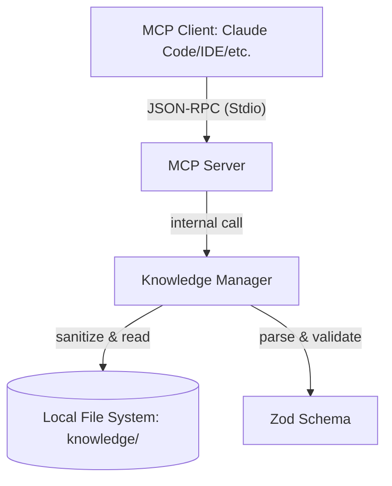

# Architecture

`mcp-server-knowledge` は、ローカルの Markdown ファイル群を構造化されたナレッジとして管理し、Model Context Protocol (MCP) を通じて AI エージェントに提供します。

## システム構成

## 主要コンポーネント

### 1. Protocol Layer (`src/index.ts`)

`@modelcontextprotocol/sdk` を使用し、Stdio トランスポート層を管理します。
以下のツールを公開します：

- `list`: 指定されたパス配下のディレクトリとファイルを一覧表示します。
- `read`: 指定された記事の本文を読み取ります。
- `search`: 全記事のタイトル、本文、タグ、エイリアスからキーワード検索を行います。
- `related`: 指定された記事に関連する記事を推薦します。

### 2. Knowledge Manager (`src/knowledge.ts`)

ファイルシステムへのアクセスを抽象化し、以下の責務を担います：

- **安全なパス解決**: `sanitizePath` と `assertWithinDir` により、Path Traversal 攻撃を防止します。
- **メタデータの抽出**: Markdown の Frontmatter (YAML) をパースし、記事の属性を取得します。
- **推薦アルゴリズム**: 以下の重み付けに基づき関連度を算出します。
  - 同一ディレクトリ内: +3
  - 共通のタグ: 1タグにつき +2
  - エイリアスの重複: +1

### 3. Schema Layer (`src/schema.ts`)

Zod を使用して、記事の Frontmatter の構造と制約を定義します。

- `reviewed`: ISO 8601 形式の最終レビュー日（必須）。
- `tags`: 定義済みのタグリスト（オプション）。
- `aliases`: 検索や関連度計算に使用される別名リスト（オプション）。
- `stability`: 記事の安定性 (`ga`, `beta`, `research-preview`, `deprecated`)。

## セキュリティ設計

本サーバーはローカル実行を前提としていますが、AI エージェントが任意のパスを読み取ろうとするリスクに備え、以下の多層防御を実装しています。

1. **ディレクトリ隔離**: すべての操作は実行時に指定されたナレッジディレクトリ内に限定されます。
2. **パスの無害化**: `\`, `..`, `null byte`, 絶対パスといった危険な文字列を除去・拒絶します。
3. **明示的なバリデーション**: 読み取ったすべての Frontmatter は Zod で検証され、不正な形式の記事はサーバー起動時に検出されます。

## テスト戦略

- **Unit Tests**: `src/` の全ロジックパスを Vitest で検証。カバレッジ 100% を維持。
- **E2E Tests**: 実際にサーバープロセスを起動し、JSON-RPC レベルでの通信とバイナリの動作を保証。
- **Security Tests**: Path Traversal 等の攻撃パターンに対する防御力を検証。
